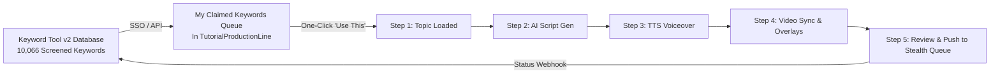

# Keyword Engine Analysis & Unified Integration Plan

**Target:** Keyword Tool v2 & Tutorial Production Line  
**Date:** August 16, 2026  
**Auditor:** Principal Engineer (Titan Edition)

---

## 1. State of the Keyword Tools

### A. The Client's Old Implementation (`rhyleematte/Youtube-Automation`)
* **Data Source:** Brittle serial calls to `suggestqueries.google.com`.
* **Search Volume:** 100% fake random integers (`Math.floor(Math.random() * 400000) + 50000`).
* **Storage:** Primitive SQLite table with no relations to actual video jobs.
* **Triage / Quality Screening:** Non-existent. Unrecordable, irrelevant topics clutter the list.

### B. Konrad's Enterprise Engine (`Keyword Tool v2` on VPS `65.108.6.149`)
* **Scale:** **23,453 real keywords** stored and indexed in PostgreSQL.
* **DeepSeek AI Screening:** **16,146 Approved**, **1,497 In Review**, **5,810 Rejected** (`backend/v5/screen.py`).
* **Classification:** **14,985 HOW_TO**, 5,834 Full Tutorial, 613 List, 286 Review.
* **Platform Gate:** Rule-based filter rejecting off-platform/unproducible mobile/console topics before billing tokens.
* **Active Screened Pool Ready for VAs:** **10,066 high-value keywords**.

---

## 2. Identified Gaps in Keyword Tool v2 & Direct Fixes

Although the backend intelligence in KTv2 is exceptional, operational bottlenecks existed due to UI/routing gaps:

### Gap 1: Ian's Dual Accounts
* **Problem:** Ian logs in with `decastroian76@gmail.com` (assigned role `va`) instead of `ianchristopherwork1@gmail.com` (assigned role `manager`). Consequently, he sees no manager assignment controls.
* **Fix:**
  1. Promote `decastroian76@gmail.com` to `role='manager'`.
  2. Set `ianchristopherwork1@gmail.com` to `role='disabled'`.
  3. Migrate historical `claimed_by` foreign keys.

### Gap 2: Manager Assignment Capabilities
* **Problem:** Ian cannot bulk-assign keywords or reassign stale claims.
* **Fix:**
  1. Extend `backend/routers/bulk.py` to allow managers to bulk-assign `assignee` / `claimed_by` for a chosen VA.
  2. Implement soft-rejection (`status='REJECTED'` with `discard_reason` and `discard_category`) so the DeepSeek screener can learn from discarded rows.
  3. Server-side enforce `role in ('manager', 'admin')` on all assignment endpoints.

### Gap 3: Routing to Konrad's 3 Owned Channels
* **Problem:** Keywords lacked explicit routing to Konrad's three distinct production channels:
  * **Your VirtualFD:** Corporate tooling, ERP, stock management, finance, business planning.
  * **Entrepreneurs Skool:** Entrepreneur apps (Notion, Figma, Canva, etc.) plus high-volume office tools (Excel, Word, Power BI).
  * **Blink Blueprint:** Full software walkthroughs and complete app overviews.
* **Fix:**
  1. Add `kt_owned_channels` relation (`Your VirtualFD`, `Entrepreneurs Skool`, `Blink Blueprint`).
  2. Prompt DeepSeek during daily screening to suggest the target owned channel.
  3. Allow manager overrides on the board.

### Gap 4: VA Configurable Filters
* **Problem:** VAs needed easy filter presets without losing high-volume goldmines.
* **Fix:**
  1. Default board filter to `content_type='HOW_TO'` (visibly toggleable).
  2. Expose filters for `screen_verdict`, `topic`, `saturation`, `rpm_tier`, and `win_score`.

---

## 3. The Unified Production Line Integration

In the new `TutorialProductionLine` application, the keyword workflow connects seamlessly into the 5-Step Creator:

### Key Workflow Enhancements:
1. **No Manual Copy-Pasting:** When a VA opens the Tutorial Production Line, their claimed keywords appear in an instant-load queue at the top of Step 1.
2. **One-Click 'Send to Production':** Clicking a keyword automatically populates the topic, duration, and preset channel settings.
3. **Automated Status Advancement:** As soon as the video is queued/published, a webhook notifies KTv2, updating the keyword status to `COMPLETED` without manual spreadsheet tracking.
